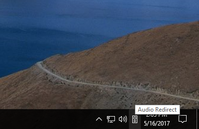
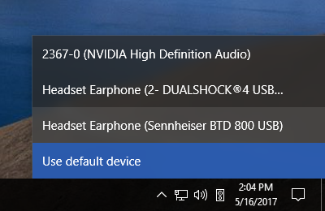
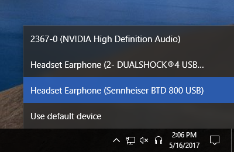
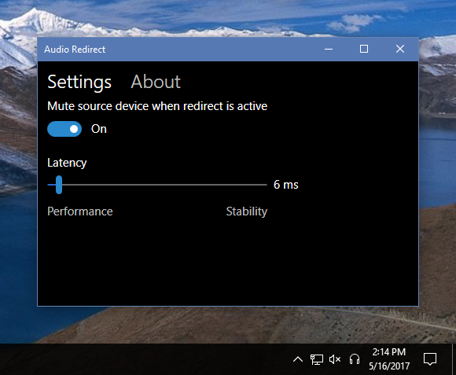

# Audio Redirect

Audio Redirect works around problems in games such as Final Fantasy XIV where
changing the system playback device causes audio to drop out until you restart
the game. It mutes the default device, captures all audio sent to it, and
redirects it to a different device instead, allowing you to change the playback
device without breaking the game's audio.

## How It Works
If you are running Windows 10, you can [install Audio Redirect from the Windows Store](https://www.microsoft.com/en-us/store/p/audio-redirect/9ph3cx3blxjz).
There may be some delay between when I publish an update to GitHub and when it
appears on the Windows Store, but it will automatically update to the latest
version.

If you'd rather install Audio Redirect the old fashioned way, download 
[the latest release](https://github.com/ChaosinaCan/AudioPipe/releases/latest)
and unzip it somewhere. Run **AudioRedirect.exe** to start the program. (You may
be prompted to install a newer version of the .NET Framework if you are running
an older version of Windows.) A speaker icon will appear in the notification area.

Click it to open a list of playback devices.

Click any device to start redirecting audio to it.

The speaker icon will change to headphones. Audio Redirect will mute your
default playback device and begin redirecting to the selected device. To stop
redirecting audio, open the list again and select **Use default device**.

You can also right click the icon and select **Settings** to adjust some settings.
If you get audio dropouts, try increasing the latency, or if your computer can
handle it, you can decrease the latency from its default of 10 ms. You can also
configure Audio Redirect to start automatically with Windows and to not mute the
default playback device if you want audio to play from both devices.

## Credits
* Audio handling uses [NAudio](https://github.com/naudio/NAudio).
* The UI code is loosely based on [EarTrumpet](https://github.com/File-New-Project/EarTrumpet).
* The error dialog uses [WPF Exception Viewer](https://www.codeproject.com/Tips/469452/WPF-ExceptionViewer).
* [The icon](https://thenounproject.com/term/audio-to-audio/914488/) is by Oliviu Stoian.
